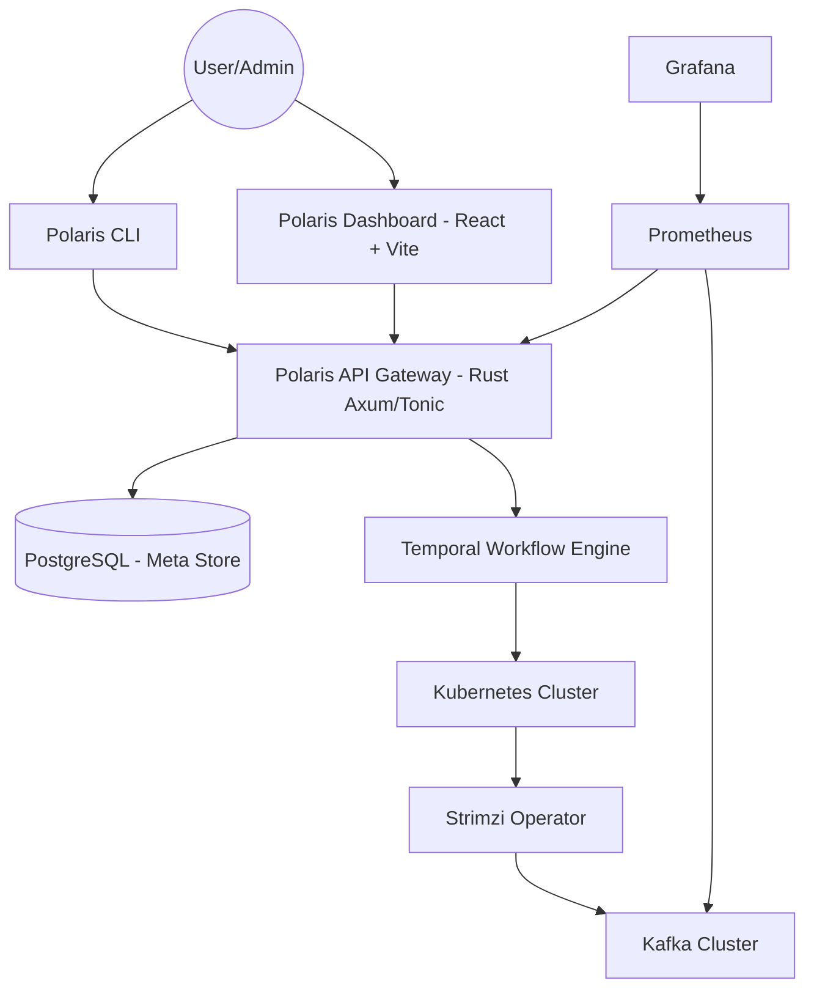
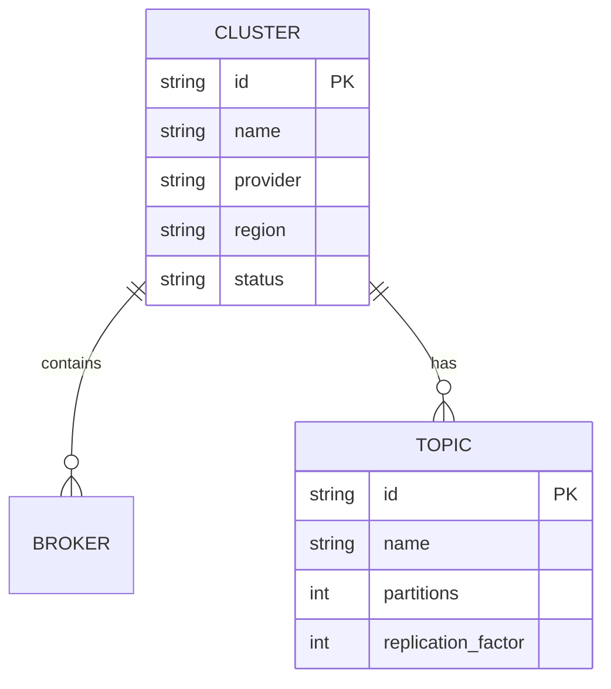

# Polaris Design Document

Polaris is a Control Plane for managing self-hosted Kafka infrastructure across multi-cloud Kubernetes environments.

## Architecture Overview

## Component Breakdown

### 1. Polaris API (Rust)
- **REST/gRPC Handlers**: Exposes endpoints for cluster lifecycle management.
- **Validation Engine**: Ensures configurations adhere to organization policies.
- **Workflow Client**: Triggers Temporal workflows for long-running operations.

### 2. State Management (Temporal)
- **Provisioning Workflow**: Multi-step process to setup K8s namespaces, secrets, and Strimzi Kafka resources.
- **Scaling Workflow**: Safely scales brokers and coordinates partition rebalancing.
- **Upgrade Workflow**: Manages rolling restarts and version updates.

### 3. Metadata Store (PostgreSQL)
- Stores cluster definitions, status, history, and audit logs.
- Managed via `SQLx` with migrations.

### 4. Infrastructure Layer
- **Strimzi**: Manages the Kafka clusters within Kubernetes.
- **Istio**: Handles service-to-service communication, mTLS, and traffic shaping.

## Data Model

