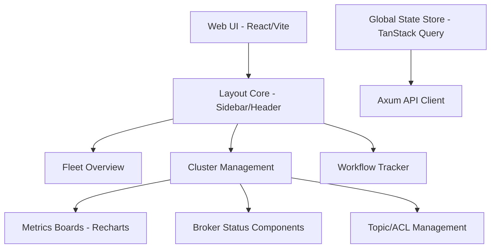
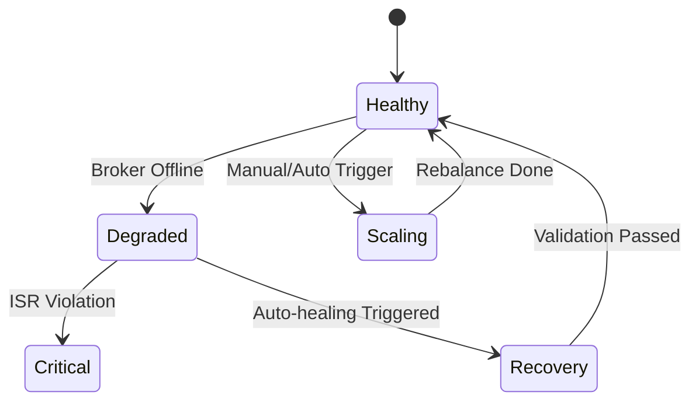

# Polaris UI Design Document

## 1. Vision & Design Principles
Polaris is the control plane for self-hosted Kafka. The UI must empower Platform Engineers to manage complex streaming infrastructure with confidence and precision.

- **Visibility-First**: Real-time status of clusters, brokers, and partitions across all clouds.
- **Guardrails, Not Gates**: Prevent common mistakes (e.g., scaling too fast, deleting active topics) with validation and confirmations.
- **Workflow-Centric**: Clear tracking of long-running operations (provisioning, scaling, upgrades) via Temporal integration.
- **Modern Aesthetics**: A premium, high-contrast dark theme (Polaris Night) with vibrant status indicators.

## 2. Information Architecture

### Navigation Structure
- **Dashboard**: High-level fleet overview and global health.
- **Clusters**: List of all managed Kafka clusters.
    - *Sub-view*: Cluster Detail (Brokers, Topics, ACLs).
- **Workflows**: Active and historical system operations (Temporal).
- **Infrastructure**: K8s clusters and cloud provider connections.
- **Security**: Certificate management, Audit logs.
- **Settings**: User preferences, API keys.

## 3. Core Views & Components

### A. Fleet Overview Dashboard
A global map or high-density list showing the distribution of Kafka clusters across AWS, GCP, Azure, and On-prem.

- **KPIs**: Total Clusters, Healthy/Unhealthy count, Multi-cloud distribution, Total Throughput.
- **Alert Stream**: Real-time feed of ISR violations, broker failures, or scaling events.

### B. Cluster Detail Page
The "Command Center" for a specific Kafka cluster.

- **Status Header**: Name, Version, Cloud/Region, Health status.
- **Broker View**: Visual representation of pods, CPU/Memory/Disk usage, and role (Controller/Broker).
- **Traffic Graphs**: Inbound/Outbound byte rates, message rates.
- **Topic Management**: List of topics with partition counts, replication factors, and lag metrics.

### C. Provisioning & Scaling Wizards
Guided forms to minimize configuration errors.

- **Cluster Creation**: Select cloud -> Select region -> Choose hardware profile -> Configure Kafka parameters -> Review & Submit.
- **Scaling UI**: Slider-based broker adjustment with impact analysis (e.g., "This will trigger partition rebalancing for 2.4 TB of data").

## 4. UI Component Architecture

## 5. Visual Identity (Design System)

### Color Palette
- **Background**: `#0F172A` (Slate 900)
- **Primary**: `#38BDF8` (Sky 400 - Polaris Blue)
- **Success**: `#10B981` (Emerald 500)
- **Warning**: `#F59E0B` (Amber 500)
- **Danger**: `#EF4444` (Red 500)
- **Surface**: `#1E293B` (Slate 800)

### Typography
- **Headings**: `Outfit` or `Inter` (Bold)
- **Body**: `Inter` (Regular/Medium)
- **Monospace**: `JetBrains Mono` (For cluster names and IDs)

## 6. Interaction Model

### Real-time Updates
- The UI uses Server-Sent Events (SSE) or WebSockets to reflect status changes immediately without refresh.
- **Progressive Disclosure**: Detailed metrics are hidden behind "Show More" to avoid information overload.

### State Transitions

## 7. Next Steps
1.  Initialize React + Vite + Tailwind project.
2.  Build the "Fleet Overview" mockups.
3.  Integrate TanStack Query for Kafka metadata fetching.
